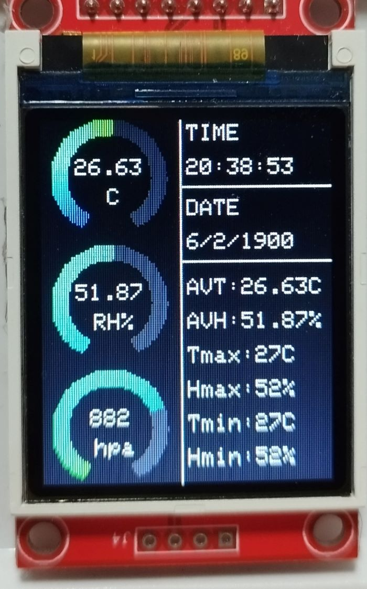
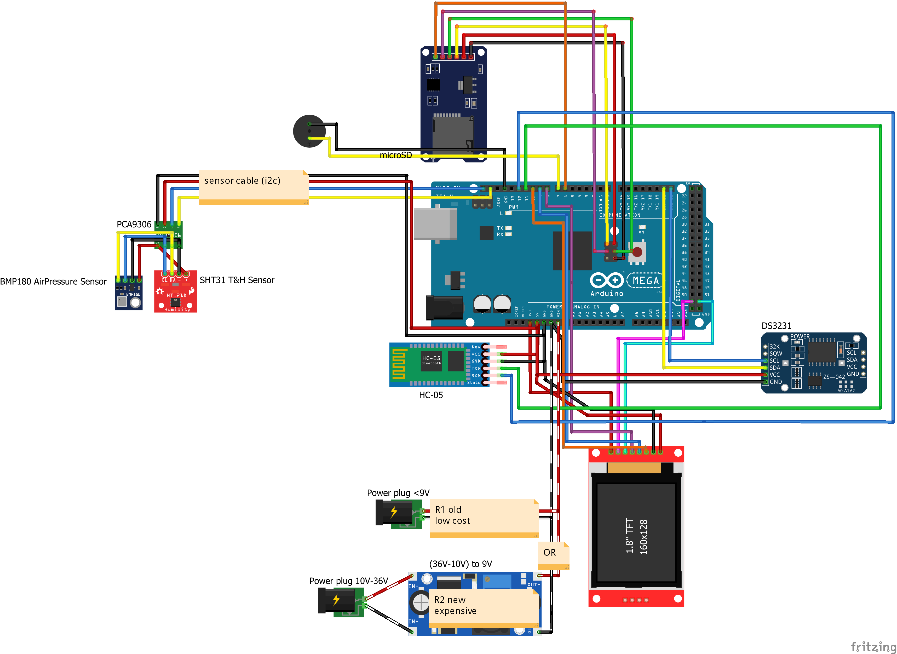

# Arduino Advanced Datalogger

This project is an advanced datalogger that logs temperature, humidity, and air pressure. It uses an Adafruit SHT31 sensor for temperature and humidity, and a BMP180 for air pressure.

## Features

- Logs temperature, humidity, and air pressure.
- Manages files on an SD card.
- Creates log files for data.
- Uses a TFT screen (Adafruit ST7735) for display.
- Can transfer data live via Bluetooth.
- Allows for changing configurations via Bluetooth commands.
  
### and more... take a look at the code `Datalogger.ino`

### TFT screen style ↓

>  **Note**\
>  Please note that the data and time in the img is not set correctly.
> 
## Hardware Requirements

- Arduino board (Mega 2560 recommend)
- Adafruit SHT31 sensor
- BMP180 sensor
- Adafruit ST7735 TFT screen
- SD card module
- Bluetooth module
  
### and more in the circuit diagram ↓

## Software Requirements

- Arduino IDE

## Installation

1. Connect the hardware as per the circuit diagram.
2. Install the required libraries in the Arduino IDE.
3. Upload the Arduino sketch to the board.

## Usage

1. Power on the Arduino board.
2. The device will start logging data and display it on the TFT screen.
3. To transfer data live or change configurations, connect to the device via Bluetooth and send the appropriate commands.

## Contributing

Contributions are welcome. Please open an issue or submit a pull request.

## License

### This project is licensed under the [GNU General Public License v3.0 License](LICENSE).
